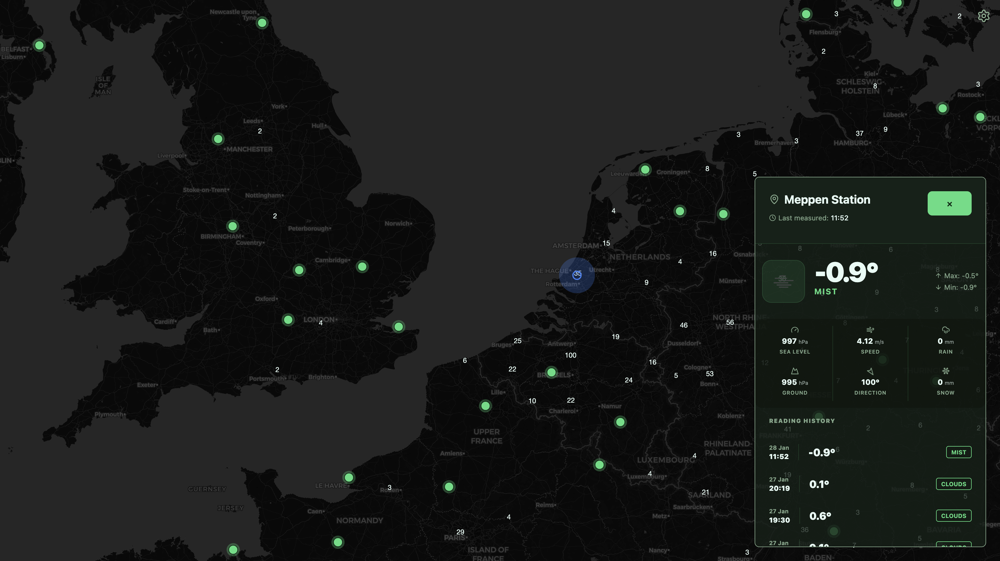
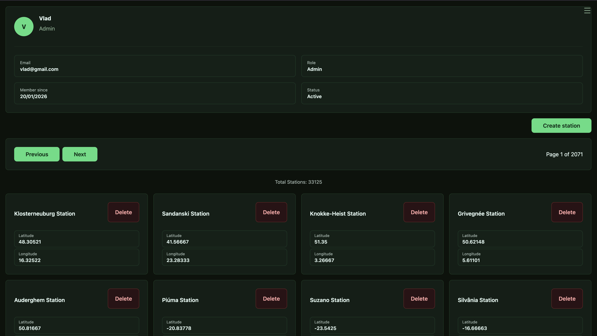
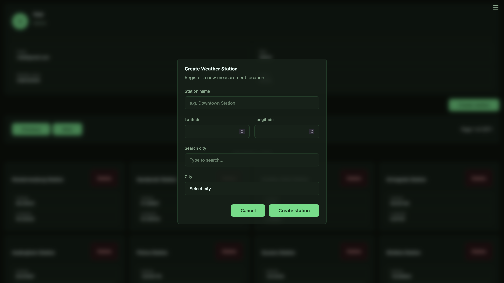

# 🌍 Weather Station Network

One day, for a university project, I built a mini weather station from scratch. I wanted to monitor the environment around me, but I quickly hit a wall: there wasn’t a dedicated, accessible platform to visualize my own hardware's measurements or share that data with others.

**That was the spark for this project.** I built this application to bridge the gap between hardware and data visualization. It’s an interactive, community-driven platform where people can register their own weather stations, collect environmental data, and share it with the world via an interactive global map.

---

## 🚀 The Vision

This isn't just a weather app; it's a **Station-as-a-Service** platform. Users can explore a worldwide map of markers. Clicking a station reveals a professional floating dashboard with high-fidelity, real-time measurements—providing immediate insight into micro-climates across the globe.

---

## 🏗️ Architectural Excellence (N-Layer)

To ensure this platform is "portfolio-ready" and scalable, I implemented a strict **N-Layer Architecture** (Domain, Application, Infrastructure, API). This separates the business logic from the technical implementation, making the system highly maintainable.

### Backend Strategy (C# / .NET 8)

- **Clean Data Flow**: Powered by **Entity Framework Core** and **PostgreSQL**
- **Identity & Security**: Custom-built **JWT Authentication** with RBAC (Role-Based Access Control)
- **Background Processing**: IHostedServices act as data accumulators, ensuring readings are synced and processed without blocking user interactions

### Frontend Strategy (React & Vite)

- **Interactive UX**: A custom map implementation with high-performance markers
- **Modern Styling**: Utility-first CSS with **Tailwind 4.0** and a custom-built **Theme Engine** (supporting Dracula, Nord, and more)
- **Real-time Feel**: Precision components designed to show data measured just minutes ago

---

## 🛠️ Tech Stack

| Layer | Technology |
| :--- | :--- |
| **Language/Framework** | C# / .NET 8 / React (Vite) |
| **Persistence** | PostgreSQL + EF Core |
| **Security** | JWT (JSON Web Tokens) + BCrypt |
| **DevOps** | Docker & Docker Compose |
| **Styling** | Tailwind CSS + Lucide Icons |

---

## 🚦 Getting Started

### 1. Environment Configuration

Create a `.env` file in the root directory:

    POSTGRES_USER=username
    POSTGRES_PASSWORD=password
    POSTGRES_DB=weather
    POSTGRES_PORT=5432
    ASPNETCORE_ENVIRONMENT=environment Development or Production
    JWT_SECRET=jwt_secret
    OPEN_WEATHET_API_KEY=api_key

### 2. Launch with Docker

The entire ecosystem is containerized for seamless deployment:

    docker-compose up --build

**Available Services:**

- **API Gateway**: http://localhost:5001
- **Client Dashboard**: http://localhost:3000

---

## 🔒 Security & Performance

- **N-Layer Decoupling**: Business rules are isolated from the database and API
- **Global Error Handling**: Middleware ensures consistent API responses and logging
- **Dockerization**: Every component—from the Postgres DB to the React frontend—is isolated, ensuring it runs on any machine

---

**Developed by Vlad**  
*Building the bridge between hardware measurements and beautiful data.*

---

**IMAGES**

